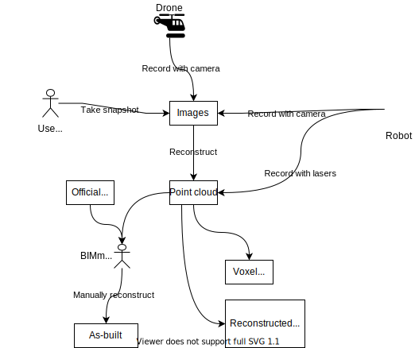

<rasaeco-meta>
{
    "title": "Digital Reconstruction",
    "contact": "Dag Fjeld Edvardsen <dag.fjeld.edvardsen@catenda.no>, Marko Ristin <rist@zhaw.ch>",
    "relations": [
        { "target": "virtual_inspection", "nature": "observations" },
        { "target": "thermal_inspection", "nature": "observations" }
    ],
    "volumetric": [
        {
            "aspect_from": "as-observed", "aspect_to": "as-observed",
            "phase_from": "construction", "phase_to": "construction",
            "level_from": "site", "level_to": "site"
        }
    ]
}
</rasaeco-meta>

## Summary

This scenario covers the digital representation of the physical world evolving over the time. 

The digital representation includes <modelref name="images" />, 
<modelref name="point_cloud" />, 
<modelref name="voxel_cloud" />, 
<modelref name="reconstructed_geometry" />, 
and <modelref name="as-built" />.

The <ref name="object_recognition" /> is intentionally left out as out-of-scope from the
BIMprove project as well as semantic interpretation of <ref name="point" />s and 
<ref name="surface" />s.

## Models

<model name="images">

This model contain all the <ref name="image" />s recorded manually (*e.g.*, by a smartphone) or
automatically (*e.g.*, by an UAV or statically installed cameras through 
a <ref name="recording" />) over time.

We expect the images in JPEGs.
The meta-data such as orientation, position and sensor range 
(*e.g.*, for <ref name="thermal_inspection#thermal_image" />s) is expected in 
[EXIF](https://en.wikipedia.org/wiki/Exif).

</model>

<model name="point_cloud">

This model encompasses all the <ref name="point" />s of the physical building over time. 

The expected format of the point cloud is [E57](http://www.libe57.org/).
Our system will use [E57](http://www.libe57.org/) as an exchange format (*e.g.*, for import/export).
The backend can use arbitrary format for storage and manipulation. 

</model>

<model name="voxel_cloud">

This model includes all the <ref name="voxel" />s over time.

</model>

<model name="reconstructed_geometry">

This model captures all the reconstructed <ref name="surface" />s.

</model>

<model name="as-built">

The as-built model is obtained by combining <ref name="point" /> cloud
and the latest version of <modelref name="evolving_plan#bim3d" />.

The model is updated continuously by a <ref name="bimmer" />.

Unlike <modelref name="evolving_plan#bim3d" />, this model is not *official*.

The entity identifiers from this model should match the identifiers from 
<modelref name="evolving_plan#bim3d" />.

</model>

## Definitions

<def name="recording">

The recording is a sequence of <ref name="image" />s and <ref name="point" />s recorded by an 
<ref name="uxv_recording#UXV" /> (with different <ref name="uxv_recording#sensor" />s such as 
photo cameras, FARO lasers, LiDARs, thermal cameras *etc.*).

The recording is assumed atomic (*i.e.* "discrete", as opposed to *continuous* recording from, say,
a static camera observing a scene).

We also assume that the relevant objects *do not* move during the recording. 
However, some movement is possible, though (*e.g.*, workers and vehicles on the site, 
other <ref name="uxv_recording#UXV" />s *etc.*).

The <ref name="uxv_recording#sensor" /> as well as the <ref name="uxv_recording#spatial_accuracy" />
of the sensor should be defined in the recording.

For example, lasers might have the <ref name="uxv_recording#spatial_accuracy" /> in millimeters, while 
the <ref name="uxv_recording#spatial_accuracy" /> of the photo odometry can be in low-digit 
centimeters (depending on the texture, lighting conditions *etc.*).

</def>

<def name="image">

An image is a picture taken by a camera.

The camera can be a photo camera (taking RGB images), but can also be a thermal camera (taking
<ref name="thermal_inspection#thermal_image" />s).

</def>

<def name="point">

A point is a 3D representation of a physical building.

Each point is:
* given a color.
* associated with its source (*e.g.*, unique identifier of an <ref name="uxv_recording#UXV" /> 
  as well as the <ref name="uxv_recording#sensor" />), and
* attributed with the time stamp corresponding to the moment of the observation (as opposed 
  to the moment of the reconstruction).

</def>

<def name="voxel">

Voxel is a small cube or union of cubes abstracting the individual <ref name="point" />s.

Voxel cloud is stiched together from <ref name="point" /> cloud 
by binning points to pre-defined cubes and unions of cubes.

It is a poor man's reconstructed geometry.

Each volumetric shape is also associated a time stamp based on the underlying points.

The color of a shape is determined by inferring it from the underlying points.
(We might consider color spaces like CIE, LAB *etc.* Vector average of RGB is perceptually wrong.)

The color gives you the similarity of the points (in addition to their mutual proximity) so that
cubes with different colors should not be merged.

Analogously, the time stamp of the voxel is given by the average over the corresponding points.

</def>

<def name="surface" >

A surface is a 3D shape given as surface.

The surface is reconstructed based on the <ref name="point" /> cloud.

Reconstructed surfaces are not semantically interpretable. 
The main purpose of the geometry is visualization, not semantic recognition.
Hence there is no link to BIM models and this is intentionally left out-of-scope. 

The time stamp of a surface is computed based on the average of the time stamps of its points. 

</def>

<def name="object_recognition" >

Recognized objects (based on images or point cloud) are not part of the BIM model.

Such objects include tools, debris, safety nets *etc.*

Some objects, such as safety nets, can not be detected with a point cloud and need to rely
on images for texture.

This is a non-goal, as we lack the resources (foremost data, but also time, qualifications, focus).
However, we should keep in mind that the system should prepare the data for recognition in a 
future project.

</def>

<def name="bimmer" >

This person updates the geometry of <modelref name="as-built" /> on a continuous basis.

</def>

## Scenario

### As-planned

The as-planned data is coming from <modelref name="evolving_plan#bim3d" />. 

### As-observed

**Raw**.
The "raw" observations come from the <ref name="image" />s (manual snapshots or recorded by
an UAV in a <ref name="recording" />) and are kept in <modelref name="images" />.

**Point cloud**. 
The <ref name="point" /> cloud is reconstructed by external software from the 
<modelref name="images" /> and stored to <modelref name="point_cloud" />.
(The external software is not part of the BIMprove development efforts.)

Additionally, <modelref name="point_cloud" /> includes also the <ref name="point" />s
that are recorded by lasers (in case there is a <ref name="uxv_recording#sensor" /> 
 during a <ref name="recording" />).
 
Finally, the BIMprove system should provide an import end-point so that arbitrarily point clouds
can be imported.
For example, the crew could use external smartphone apps to record a point cloud, 
special hand-held lidars *etc.*
We do not want to constrict the range of recording devices.
The source as well as the sensor accuracy need to be specified accordingly. 

**Visualizable abstractions.**
We further abstract <ref name="point" />s from the <modelref name="point_cloud" />
into:
* <ref name="voxel" />s of <modelref name="voxel_cloud" />
using binning and aggregation of bins, and 
* <ref name="surface" />s using geometry reconstruction.

The main aim of both the <ref name="voxel" />s and <ref name="surface" />s is easier visualization
of the physical world.

(We will probably not have time to implement the geometry reconstruction in BIMprove system.
There might be perhaps libraries to easily reconstruct it from the point cloud on the backend
side.
As we don't know that at this point (2021-01-20), we leave it here as a nice-to-have.)

**As-built plan.**

In addition to semantically uninterpretable observations (such as <ref name="image" />s and 
<ref name="point" />s), our system needs the interpretable observation.

This is given in the model <modelref name="as-built" />. This model is continuously
updated (*e.g.*, daily) by the <ref name="bimmer" /> using external software to
model the current state of the physical building digitally using as base the official plans 
<modelref name="evolving_plan#bim3d" />, previous version of 
<modelref name="as-built" /> (if available) and 
<modelref name="point_cloud" />.

The external software for BIM reconstruction (and adaptation to observed data) is not part of the
BIMprove development efforts. Some software solutions include:
* https://bimandscan.com/autocorr/
* https://www.clearedge3d.com/products/verity/
* https://www.imerso.com/ 

TODO: add link here to divergence_detection -- this depends how we compute the divergence, 
manually or based on as-built bim.

### Divergence

All the observations (like <ref name="image" />s and <ref name="point" /> cloud) need to be 
converted to our main <ref name="evolving_plan#site_coordinate_system" />.

Whatever data comes into the backend needs to be pre-processed appropriately to conform to
<ref name="evolving_plan#site_coordinate_system" />.

*The remaining aspect sections intentionally left empty.*

## Test Cases

## Acceptance Criteria

<acceptance name="timestamps_of_points_manageable">

The timestamps for individual <ref name="point" />s of the point clouds should be appropriately 
compressed so that we add only a word (2-bytes) or attach a timestamp to a group of points *etc.*

</acceptance>

<acceptance name="granularity_of_timestamps">

As <ref name="point" />s of the point cloud are attributed a time stamp, the time stamp
does not need to be extremely precise. For example, if we take 50 images of a single point,
the time stamp of the point can be the average (or minimum or maximum) over the corresponding 
timestamps of the images.

</acceptance>

<acceptance name="visual_veracity_of_geometry">

The geometry might look "melted" as we lack points from all the viewpoints.

</acceptance>
