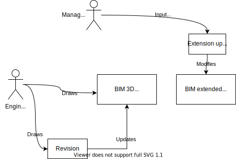

<rasaeco-meta>
{
    "title": "Evolving Plan",
    "contact": "Dag Fjeld Edvardsen <dag.fjeld.edvardsen@catenda.no>, Gabor Sziebig <gabor.sziebig@sintef.no>, Marko Ristin <rist@zhaw.ch>, Ruprecht Altenburger <altb@zhaw.ch>",
    "relations": [
        { "target": "virtual_inspection", "nature": "BIM" }
    ],
    "volumetric": [
        {
            "aspect_from": "as-planned", "aspect_to": "as-planned",
            "phase_from": "planning", "phase_to": "construction",
            "level_from": "site", "level_to": "site"
        }
    ]
}
</rasaeco-meta>

## Summary

This scenario examines how the BIM plans evolve over time.

This scenario does not talk about the updates based on the observed data (such as images, point
clouds and voxel clouds).

It is about the updates of the federated BIM model.

## Models

<model name="bim3d">

<phase name="planning">This BIM model is provided after the planning phase</phase> and 
<phase name="construction">updated throughout the construction</phase>.

The plan is updated as the building grows.

This is the federated model of all the individual domain models.

We assume that the model *excludes* the time, schedule, the tasks, the costs, the actors *etc.*

It only *includes* the geometry (3D).

</model>

<model name="bim_extended">

This model extends <modelref name="bim3d" /> by including additional entities which
were not provided in the official plan.

These entities include:
* additional zones (*e.g.*, for deliveries),
* actors,
* tasks,
* costs,
* ... and more.

These additional entities are linked to the entities in <modelref name="bim3d" />.

</model>

## Definitions

<def name="guid">

A guid is a **g**lobally **u**nique **id**entifier.

It is [specified by building smart](https://technical.buildingsmart.org/resources/ifcimplementationguidance/ifc-guid/).

</def>

<def name="revision">

<phase name="construction">The revision is an official version of 
a <modelref name="bim3d" /> at different stages of construction.</phase>

It happens maybe once a week per an important model.

These changes are *official* and they have to be signed-off (by a civil engineer, construction
engineer *etc.*) and are *legally binding*.

</def>

<def name="extension_update">

The entities of the <modelref name="bim_extended" /> are changed internally by our system.

The updates are not officially binding and can happen arbitrary often (*e.g.*, multiple times a 
day).

</def>

<def name="inconsistency">

An inconsistency is a dangling link between  

</def>

<def name="non_ifc_entity">

Non-IFC entity is an entity of our system that can not be modeled as an IFC class.

The non-IFC entities are shadowed in <modelref name="bim_extended" /> by `IfcExternalReference`.

Though `IfcExternalReference` is usually used for documents, we use it here in the sense of
[REpresentational State Transfer (REST)](https://en.wikipedia.org/wiki/Representational_state_transfer)
where everything is considered a "resource".

</def>

<def name="explorer">

The explorer allows us to view instances in <modelref name="bim3d" /> and 
<modelref name="bim_extended" /> in a browser.

This is a very low-level tool (not for visualizing 3D geometry!) and 
should not allow any modifications to the models as these are gate-kept 
by the system (and could break it).

</def>

<def name="site_coordinate_system">

This is the coordinate system of the building site.

All the elements from <modelref name="bim3d" /> live in this coordinate system.

The unit is always a [meter](https://en.wikipedia.org/wiki/Metre).

</def>

## Scenario

### As-planned

**Plans.**

<level name="site">

The planning of a construction site consist of two models:
* an official plan <modelref name="bim3d" /> (only 3D geometry, officially signed off), and
* an internal, extended plan <modelref name="bim_extended" /> 
  (changed more frequently, covering abstract entities such as tasks, actors, costs, 
   more dynamic zones *etc.*, not officially signed off).

</level>

The official <modelref name="bim3d" /> is updated through <ref name="revision" />s.
As these revisions are costly and official, they are not frequently done.

The <ref name="extension_update" /> of the internal <modelref name="bim_extended" /> 
occurs much more frequently than the official <ref name="revision" />s. 
For example, when a new <ref name="truck_guidance#delivery" /> is inserted into the system.

**Inconsistencies.** 
On every <ref name="revision" />, there might be inconsistency introduced between 
<modelref name="bim_extended" /> and <modelref name="bim3d" />.

<phase name="planning">For example, during planning, we might refer to entities which have not 
been designed yet</phase>.

<phase name="construction">An another example. An entity of <modelref name="bim3d" /> is 
deleted in a <ref name="revision" /> because it should not be eventually built, but it is 
referred to by a task entity in <modelref name="bim_extended" />.</phase> 

We consciously expect these two models to be actually inconsistent. 

The system should provide an application to highlight the inconsistencies.

**Globally unique identification**.
We expect entities in <modelref name="bim3d" /> and <modelref name="bim_extended" /> to have
<ref name="guid" />s globally unique with the respect to their union. 
A <ref name="guid" /> in <modelref name="bim_extended" /> should not conflict with a 
<ref name="guid" /> in <modelref name="bim3d" />, but mean the same entity.

For example, you should not give the same <ref name="guid" /> to a wall and to an organization. 

**Non-IFC entities**.
Our system supports many non-IFC entities (such as <ref name="risk_management#risk" /> and
<ref name="truck_guidance#delivery_update" />).

In order to make these entities referencable by IFC entities, every <ref name="non_ifc_entity" />
needs to be shadowed in <modelref name="bim_extended" /> as an `IfcExternalReference`.

**Visualization of entities**.
The system should provide a viewer of the entities.

This viewer is not meant for visualization of 3D geometry, but for exploration of existing entities
and their links to non-IFC entities. This viewer is more like a database viewer 
(kind of a "PhpMyAdmin" for BIM).

We might use a tool such as https://ifcwebserver.org/ 
(Section "Innovative Graph database data management"). In case we want to support the links to
<ref name="non_ifc_entity" />s, we might need to implement an explorer on our own (*e.g.*, using
a simple viewer in a browser based on <ref name="unique_resource_identification#identifier" />s). 

**Overview diagram**.

### As-observed

We adapt <modelref name="bim3d" /> to
<modelref name="digital_reconstruction#as-built" /> in parallel to have a semantically
interpretable representation of the physical world.

However, <modelref name="digital_reconstruction#as-built" /> is not considered a "plan",
but an "observation".

*The remaining aspect sections intentionally left empty.*

## Test Cases

<test name="inconsistent_model">

We test the system with manually designed <modelref name="bim3d" /> and
<modelref name="bim_extended" /> with inconsistencies introduced on purpose.

</test>

## Acceptance Criteria

<acceptance name="inconsistencies_dealt_with_gracefully">

The system needs to deal with the <ref name="inconsistency" />s in a graceful manner.
For example, dangling references should be checked and should not raise an exception or break
down the system.

</acceptance>