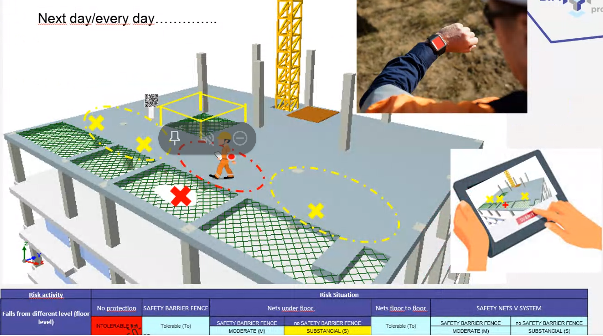

<rasaeco-meta>
{
    "identifier": "fall_risk_alert",
    "title": "Fall Risk Alert",
    "relations": [
    ],
    "volumetric": [
        {
            "aspect_from": "as-planned", "aspect_to": "divergence",
            "phase_from": "construction", "phase_to": "construction",
            "level_from": "zone", "level_to": "office"
        },
        {
            "aspect_from": "cost", "aspect_to": "analytics",
            "phase_from": "construction", "phase_to": "construction",
            "level_from": "zone", "level_to": "office"
        }
    ]
}
</rasaeco-meta>

## Summary



## Models

### plan/main

The as-planned BIM model provided after the planning phase and
updated throughout the construction.

It is going to be updated as the building grows.

This is the federated model of all the individual domain models.

### observed/point_cloud

The point cloud observed with the drones and the ground robots.

The coordinates are synchronized with the <modelref name="plan/main" />.

### observed/pictures

The pictures taken by the ground robots, drones and humans.

The coordinates are synchronized with the <modelref name="plan/main" />.
TODO: how is this synchronization done -- address it in as-observed aspect.

### observed/qr_codes

The observations of the QR codes: (the location, the time, the identifier of the 
<ref name="element"/>).

### standard/risk_level

Risk levels defined at the national and internation level.

## Definitions

### installer

The person who installed an <ref name="element"/>.

Uniquely identifiable by a contact (unstructured, can be e-mail, but also something completely 
arbitrarily such as a phone number or a company name).

In BIM:

```
IfcActor
```

### alertee

A person who needs to be alerted on his/her current risk level. 

### element

Any relevant building element from the <modelref name="plan/main"/>. 
It can be associated with <modelref name="observed/point_cloud" /> and 
<modelref name="observed/pictures" />.

In BIM:

```
IfcProduct
```

Every element needs to have a unique identifier. 

### points_in_the_vicinity

A subset of the points in the point cloud close to <ref name="element" />.

The vicinity is defined as a bounding box.

### images_of_the_element

A subset of the images that look at the <ref name="element" />.

We can compute their subset based on their coordinates and angle.

### task

Any `IfcTask` in the <modelref name="plan/main"/>

### zone

Any `IfcZone` in the <modelref name="plan/main"/>

### preventive_resource

Preventive resource is person who is in charge of the safety inside.

The preventive resource is in charge of a set of <ref name="task"/>.

Depending on the budget, there will be preventive resources in charge of 
one or more <ref name="zone" />s or <level name="site">the whole site</level>.

### health_and_safety_manager

<level name="site">Health & safety manager is in charge of the issues on the site.
The person is the boss of the health & safety of the site.</level>

### risk_level

This is the risk level according to different standards.
Refers to a concrete standard in <modelref name="standard/risk_level" />.

### fall_risk
A fall risk is an abstract entity.

It can be tied to a <ref name="zone"/> or to an <ref name="element"/>, but it doesn't need to.

The fall risk has a validity time span (which can also be open-ended).

The fall risk lives in <modelref name="plan/main" />.

## Scenario

### As-planned

We just use the federated model in <modelref name="plan/main" />.

<level name="site_office">The <modelref name="plan/main" /> data would need to be accessible from 
the office.</level>

### As-observed

All the observed data from <modelref name="observed/point_cloud" /> and
<modelref name="observed/pictures" /> lives in the same coordinate system as 
the federated model in <modelref name="plan/main" />.

Over repeated runs (*e.g.,* over the days), there will be randomized errors between the
coordinates in <modelref name="plan/main" /> and
<modelref name="observed/point_cloud" /> and
<modelref name="observed/pictures" />, including the drift and systematic errors. 

We have to see *after* the experiments whether these errors are tolerable for this
scenario.

Usually the error is below 1 meter, rarely 2 meters.

<level name="site_office">The observed data, <modelref name="observed/point_cloud" /> and
<modelref name="observed/pictures" />,  would need to be accessible from the office.</level>

### Divergence

**Start simple.** The <ref name="preventive_resource"/> and <ref name="health_and_safety_manager" />
manually inspect the <ref name="element"/>s and report absent/ill-placed to the system.

**Next step: QR code.** The QR code references the identifier of the <ref name="element"/>.
The observations of the QR code are stored in <modelref name="observed/qr_codes"/>.

Anybody authorized can add an observation of a QR code.

### Analytics

The overall view of the <ref name="fall_risk"/>s should be provided in a table.

The user can manually inspect further the related details such as associated <ref name="element"/>s.

### Scheduling

This section is empty on purpose.

### Safety

**Specification of the fall risks**.
The <ref name="preventive_resource"/> links the <ref name="element"/> with the 
<ref name="installer"/>.

<phase name="planning">The <ref name="health_and_safety_manager"/> inputs initially the 
<ref name="fall_risk"/>s manually.</phase>

The <ref name="preventive_resource"/> makes notes regarding an unsafe <ref name="element" />.
Both the <ref name="health_and_safety_manager"/> and <ref name="preventive_resource"/> can
insert new and change existing <ref name="fall_risk"/>s accordingly.

**Alerts**. The safety status <ref name="risk_level" /> is continuously displayed to 
<ref name="alertee"/>s in real-time based on the current <ref name="fall_risk"/>s and their 
location. 

The location of the actor is not stored in the backend. The update logic is running on the alertee's
device (*i.e*., a smart-watch) which sends repeated queries to the backend. 
The backend does not track the alertee.
