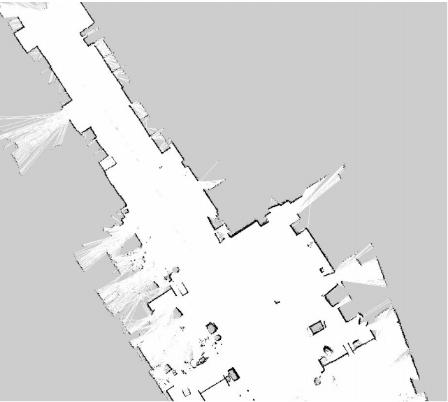

<rasaeco-meta>
{
    "title": "UXV Recording",
    "contact": "Dag Fjeld Edvardsen <dag.fjeld.edvardsen@catenda.no>, Marko Ristin <rist@zhaw.ch>",
    "relations": [
        { "target": "digital_reconstruction", "nature": "observations" }
    ],
    "volumetric": [
        {
            "aspect_from": "as-planned", "aspect_to": "divergence",
            "phase_from": "construction", "phase_to": "construction",
            "level_from": "machine", "level_to": "site"
        }
    ]
}
</rasaeco-meta>

## Summary

This scenario concerns the recording of the construction site by the <ref name="UXV" />s.

## Models

<model name="UXVs">

This model captures the list of available <ref name="UXV" />s including the details such as
available sensors.

</model>

<model name="sensors">

This model lists the <ref name="sensor" />s mounted on the <ref name="UXV" />s.

</model>

<model name="missions">

This is a model storing all the defined <ref name="mission" />s over all the <ref name="UXV" />s.

</model>

## Definitions

<def name="UXV">

<level name="machine">This is an unmanned vehicle (both aerial, UAV, and ground, UGV) recording 
the environment.</level>  

</def>

<def name="spatial_accuracy">

The spatial accuracy indicates the error between the measurement and the physical world in terms
of space.

It is defined as a scalar and associated with a unit.

For example, "3mm".

(We have to see during the implementation whether the accuracy refers to one sigma, two sigma 
*etc*.)

</def>

<def name="sensor">

<level name="device">A sensor is a device mounted on a <ref name="UXV" /> used to record the 
environment.</level>

Each sensor has a unique identifier.

The <ref name="spatial_accuracy" /> of the sensor is also defined.

The sensor specs live in <modelref name="sensors" />. 

</def>

<def name="station">

<level name="machine">A station is a separate computational unit that receives the data from the 
<ref name="UXV" /></level>.

</def>

<def name="UXV_frame">

<level name="site">The UXV frame is the coordinate system of the <ref name="UXV" />.</level>

</def>

<def name="reference_point">

A reference point is a point for which we know with certainty the position in 
<ref name="evolving_plan#site_coordinate_system" /> and in the <ref name="UXV_frame" />.

<level name="site">It is important that the reference point is measured with the highest precision
possible as the remainder of the system will rely on it.</level>

</def>

<def name="marker">

Markers are specific objects (*e.g.*, a printed picture glued to a wall or a floor) representing
a specific <ref name="reference_point" />.

</def>

<def name="localization">

<level name="machine">This is the process of determining the position of the <ref name="UXV" /> 
in terms of <ref name="UXV_frame" />.</level>

Note that the <ref name="UXV_frame" /> is defined at the beginning of the 
<ref name="digital_reconstruction#recording" />.
This is not necessarily the <ref name="evolving_plan#site_coordinate_system" />,
but the observed points need to be consistent to <ref name="UXV_frame" />. 

</def>

<def name="coordinate_conversion">

This is the conversion of <ref name="digital_reconstruction#point" />s and 
<ref name="digital_reconstruction#image" />s by mapping from <ref name="UXV_frame" /> to the 
<ref name="evolving_plan#site_coordinate_system" /> based on observations of 
the <ref name="reference_point" />s.

For example, the <ref name="UXV" /> needs to observe <ref name="reference_point" />s and
infer the mapping between the same <ref name="reference_point" /> in <ref name="UXV_frame" /> and
<ref name="evolving_plan#site_coordinate_system" />.

Note that this conversion is not referring to geo-coordinates (*e.g.*, global world coordinates),
but the conversion between <ref name="UXV_frame" /> and
<ref name="evolving_plan#site_coordinate_system" />.
This confusion often comes up in the discussion with the construction engineers.

</def>

<def name="operator">

This is a person operating the <ref name="UXV" /> for the safety reasons.

If something goes wrong, the operator is supposed to take over.

</def>

<def name="point_of_interest">

The point of interest is a point in <ref name="evolving_plan#site_coordinate_system" />
that needs to be particularly recorded.

The point of interest can include the field of view.

</def>

<def name="object_of_interest">

The object of interest that requires a special focus during the
<ref name="digital_reconstruction#recording" />.

The object of interest can include the field of view.
If the field of view is not defined, the field of view needs to be automatically inferred by the
<ref name="UXV" />.

</def>

<def name="volume_of_interest">

The volume of interest is a cube defined in <ref name="evolving_plan#site_coordinate_system" />
that we want an <ref name="UXV" /> to explore.

This helps the navigation of the <ref name="UXV" /> so that it can plan the trajectory.

For example, define the important zones such as rooms or floors.

This is different to <ref name="point_of_interest" /> in way that the robot just records everything
in the volume of interest without any specific focus.

</def>

<def name="mission">

A mission is an execution of a <ref name="digital_reconstruction#recording" /> based on a 
specific <ref name="UXV" /> and given the list of <ref name="volume_of_interest" />s.

The mission is also given the start time point and an optional end time point.

The <ref name="sensor" />s need to be specified per a <ref name="volume_of_interest" />.

For each <ref name="volume_of_interest" />, we specify the length the recording (*e.g.*, record this
point for 30 seconds).

</def>

<def name="live_streaming">

A live streaming is a real-time transmission of the sensor data to the <ref name="station" />.

</def>

<def name="navigation_map">

The navigation map is a 2D representation of the environment.

It is recorded by the navigation tools of the <ref name="UXV" /> (which are not necessarily
the same tools used for the recording!).

The navigation map is taken care of by the robot system (include the <ref name="station" />),
not by the BIMprove backend.

Here is an example of a navigation map visualized as an image:

</def>

<def name="focus_spot">

A focus spot is a structured <ref name="topic_management#topic" /> signaling to the 
<ref name="operator" /> what relevant spots in the construction sites need to be recorded.

For example, this can be a particular spot that the <ref name="risk_management#risk_manager" /> 
needs to have examined.

The necessary <ref name="sensor" />s need to be indicated in the 
<ref name="topic_management#comment" />s.
For example, it can be that we need photo cameras, very precise lasers and/or thermal camera.

(We have to see in the implementation if the <ref name="topic_management#comment" />s should be
free form or structured.) 

</def>

## Scenario

### As-observed

**Process**.

<level name="machine">

* <ref name="UXV" /> needs to perform the <ref name="localization" />.
* The <ref name="mission" /> is specified by the <ref name="operator" />
* <ref name="UXV" /> drives or flies around and records the data.
* The data is sent to the <ref name="station" />.
* The <ref name="station" /> post-processes the data (*e.g.*, reconstructs the images to point 
  clouds if necessary, and perform the <ref name="coordinate_conversion" />).
* The <ref name="station" /> sends the post-processed data to the backend.

</level>

**Route planning**.
There is always an <ref name="operator" /> supervising the 
<ref name="digital_reconstruction#recording" />.

<level name="site">

Users indicate indicate in the system which elements or positions need to be recorded in the 
<modelref name="evolving_plan#bim3d" /> through <ref name="focus_spot" />s.

For example, a <ref name="digital_reconstruction#bimmer" /> can specify parts of the site that
need special attention or a <ref name="risk_management#risk_manager" /> can request a recording
of a specific dangerous spot.

Mind that these <ref name="focus_spot" />s are a bit more abstract than 
<ref name="point_of_interest" />.
We assume that the <ref name="operator" /> has much better skills to define fine-grained points.
Hence the general users *describe* through <ref name="focus_spot" />s what they want to have
recorded, while the <ref name="operator" /> plans the <ref name="mission" /> in more detail
according to these <ref name="focus_spot" />s. 

</level>

<level name="machine">The <ref name="operator" /> selects the available 
<ref name="UXV" /> from <modelref name="UXVs" /> and defines a <ref name="mission" />.</level>
 
The mission is defined by specifying:
* <ref name="point_of_interest" />s,
* <ref name="volume_of_interest" />s, 
* <ref name="object_of_interest" />s,
* assigning the <ref name="sensor" />s to these points,
* time allocation *etc.*

<level name="machine">

The <ref name="UXV" /> is supposed to automatically navigate the <ref name="mission" /> based on
the <ref name="navigation_map" />.
The <ref name="navigation_map" /> does not rely on <modelref name="evolving_plan#bim3d" /> 
as it might not be trustworthy.
Instead, the <ref name="navigation_map" /> is inferred from the
 <modelref name="digital_reconstruction#as-built" />.

</level>

(Note that the navigation based on <modelref name="digital_reconstruction#as-built" /> is still
experimental.
If this navigation does not work automatically, the <ref name="operator" /> is going to drive
manually the robot in order to obtain the <ref name="navigation_map" /> using the 
<ref name="station" />.) 

There are two applications: <level name="site">one for specifying the <ref name="mission" /> 
(and managing the <ref name="UXV" />s)</level> and <level name="machine">another one for operating
the <ref name="mission" /></level>.

The missions are defined using the backend, while the operation of the <ref name="mission" /> is
performed on the <ref name="station" />.

The <ref name="station" /> needs to obtain the data from the backend.

*The other aspect sections intentionally left empty.*

### Safety

**Protection *from* the <ref name="UXV" />**.
If the <ref name="mission" /> can not be automatically accomplished, the <ref name="operator" />
needs to take over and finish the recording manually.

For example, the obstacles are automatically detected by the <ref name="sensor" />s and 
the <ref name="operator" /> is notified.
A common example is that there might be a door closed and the <ref name="UXV" /> can not continue.

**Live supervision**.
In certain construction scenarios, the building operation needs to be supervised live.

If the bandwidth allows, the <ref name="UXV" /> can be manually navigated by the 
<ref name="operator" /> to the relevant point of view and the streamed data is displayed on the
<ref name="station" />.

Please mind the strong limitations:
* bandwidth limit,
* short battery life (~20 minutes!), and
* safety issues (as <ref name="UXV" /> floats around the people).

Mind that this is a very special nice-to-have use case for <ref name="UXV" /> and is not in 
the main focus of the BIMprove project.

*The other aspect sections intentionally left empty.*

### Test cases

We are continuously experimenting with <ref name="UXV" />s in our labs.

There will be unstructured free-form tests on the construction site.

### Acceptance criteria

<acceptance name="accuracy">

We expect the accuracy errors to be in the range of centimeters.

In some parts we won't be able to provide this accuracy.
One issue are the outliers, but there are also systematic sources of errors.

We still need to figure out the actual accuracy in the field.

It would good if we could include the uncertainty in the data.
Unfortunately, the external software does not support it.

We do not have precise statistics at the moment (2021-01-22).

</acceptance>
